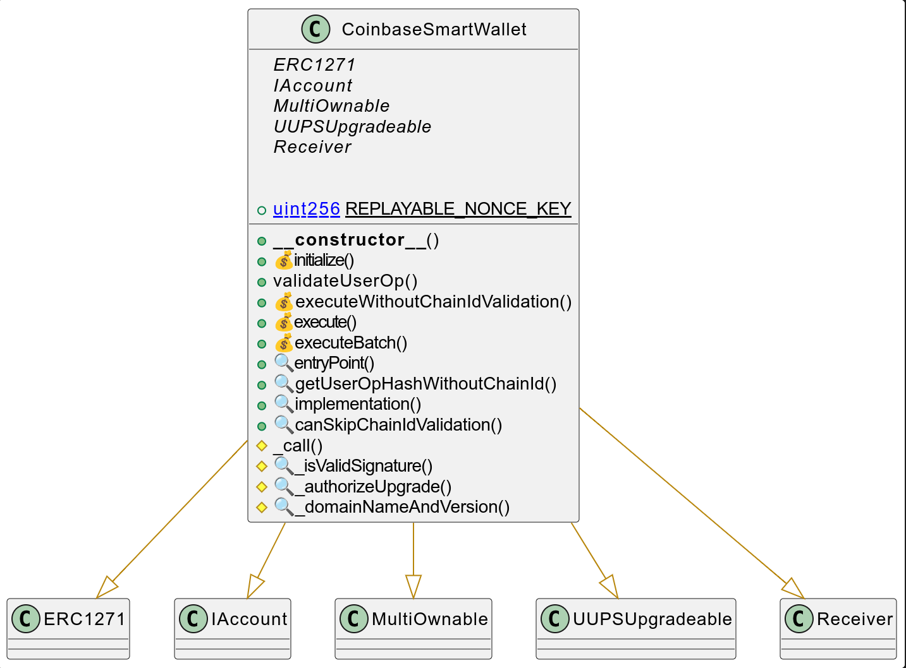
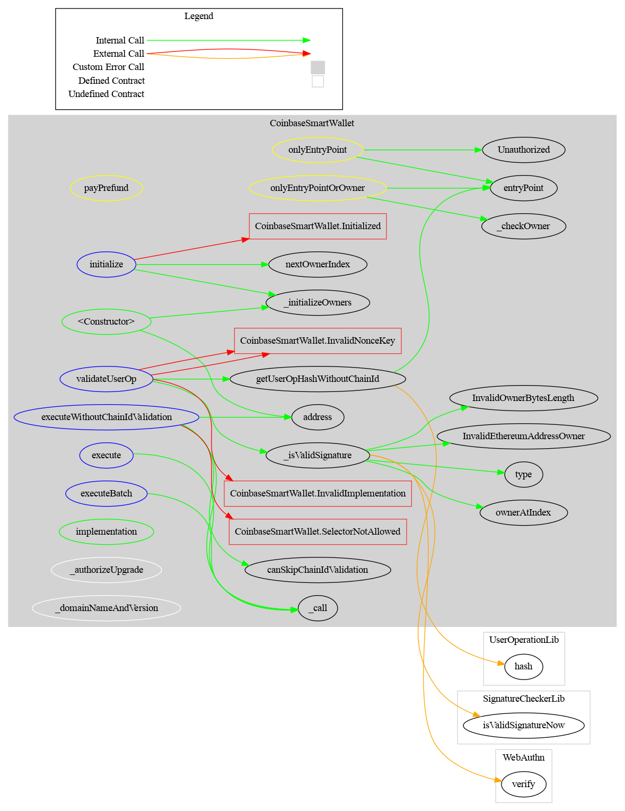
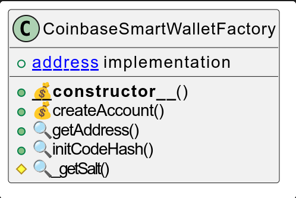
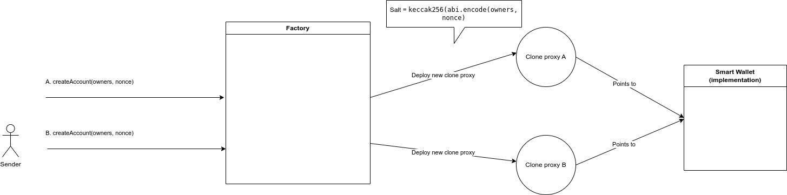
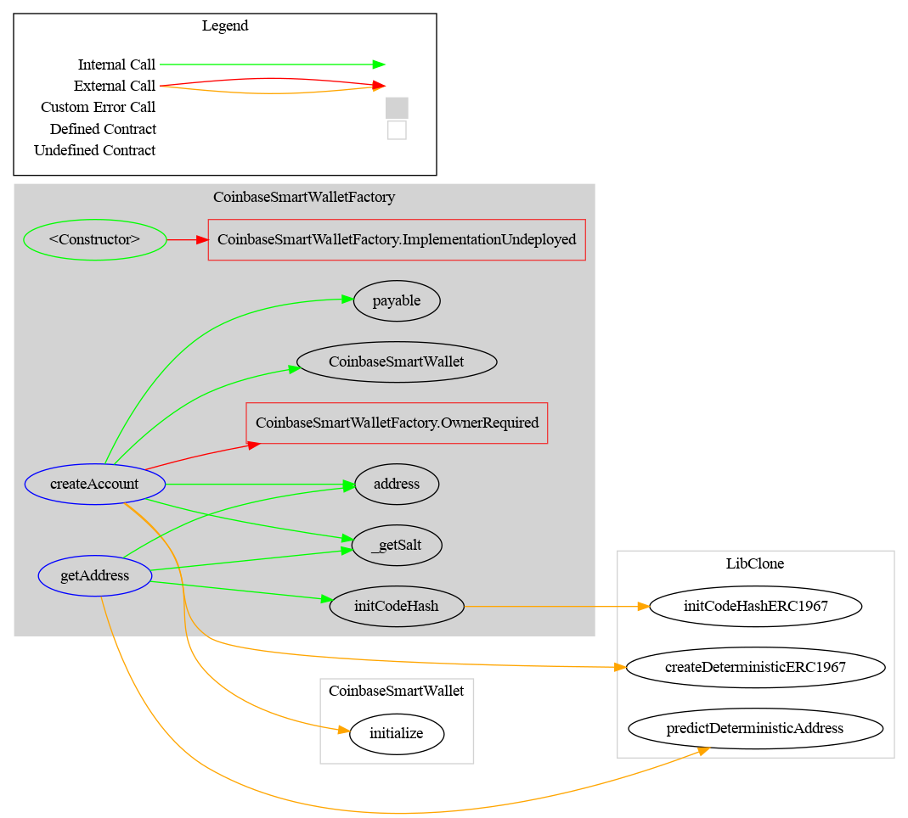

> This project is a fork of Coibase Smart Wallet
>
> No changes have been made to the original code.

# Smart Wallet

This repository contains code for a new, [ERC-4337](https://eips.ethereum.org/EIPS/eip-4337) compliant smart contract wallet from Coinbase. 

It supports 
- Multiple owners
- Passkey owners and Ethereum address owners
- Cross-chain replayability for owner updates and other actions: sign once, update everywhere. 

## Technical

### Multiple Owners

These smart wallet supports a practically unlimited number of concurrent owners (max 2^256). Each owner can transact independently, without sign off from any other owner. 

Owners are identified as `bytes` to allow both Ethereum address owners and passkey (Secp256r1) public key owners. 

### Passkey owners and Ethereum address owners
Ethereum address owners can call directly to the smart contract wallet to transact and also transact via user operations. 

In the ERC-4337 context, we expect `UserOperation.signature` to be the ABI encoding of a `SignatureWrapper` struct 
```solidity
struct SignatureWrapper {
    uint8 ownerIndex;
    bytes signatureData;
}
```

Owner index identifies the owner who signed the user operation. This must be passed because secp256r1 verifiers require the public key as an input. This differs from `ecrecover`, which returns the signer address.

We pass an `ownerIndex` rather than the public key itself to optimize for calldata, which is currently the main cost driver on Ethereum layer 2 rollups, like Base. 

If the signer is an Ethereum address, `signatureData` should be the packed ABI encoding of the `r`, `s`, and `v` signature values. 

If the signer is a secp256r1 public key, `signatureData` should be the the ABI encoding of a [`WebAuthnAuth`](https://github.com/base-org/webauthn-sol/blob/main/src/WebAuthn.sol#L15-L34) struct. See [webauthn-sol](https://github.com/base-org/webauthn-sol) for more details. 

### Cross-chain replayability 
If a user changes an owner or upgrade their smart wallet, they likely want this change applied to all instances of your smart wallet, across various chains. Our smart wallet allows users to sign a single user operation which can be permissionlessly replayed on other chains. 

There is a special function, `executeWithoutChainIdValidation`, which can only be called by the `EntryPoint` contract (v0.6). 

In `validateUserOp` we check if this function is being called. If it is, we recompute the userOpHash (which will be used for signature validation) to exclude the chain ID. 

Code excerpt from validateUserOp
```solidity
// 0xbf6ba1fc = bytes4(keccak256("executeWithoutChainIdValidation(bytes)"))
if (userOp.callData.length >= 4 && bytes4(userOp.callData[0:4]) == 0xbf6ba1fc) {
    userOpHash = getUserOpHashWithoutChainId(userOp);
    if (key != REPLAYABLE_NONCE_KEY) {
        revert InvalidNonceKey(key);
    }
} else {
    if (key == REPLAYABLE_NONCE_KEY) {
        revert InvalidNonceKey(key);
    }
}
```

To help keep these cross-chain replayable user operations organized and sequential, we reserve a specific nonce key for only these user operations.

`executeWithoutChainIdValidation` can only be used for calls to self and can only call a whitelisted set of functions. 

```solidity
function executeWithoutChainIdValidation(bytes calldata data) public payable virtual onlyEntryPoint {
    bytes4 selector = bytes4(data[0:4]);
    if (!canSkipChainIdValidation(selector)) {
        revert SelectorNotAllowed(selector);
    }

    _call(address(this), 0, data);
}
```

`canSkipChainIdValidation` can be used to check which functions can be called.

Today, allowed are 
- MultiOwnable.addOwnerPublicKey
- MultiOwnable.addOwnerAddress
- MultiOwnable.addOwnerAddressAtIndex
- MultiOwnable.addOwnerPublicKeyAtIndex
- MultiOwnable.removeOwnerAtIndex
- UUPSUpgradeable.upgradeToAndCall

## Architecture

### Smart Wallet

#### UML



#### Contract Description table

|        Contract         |              Type               |                           Bases                            |                |                           |
| :---------------------: | :-----------------------------: | :--------------------------------------------------------: | :------------: | :-----------------------: |
|            └            |        **Function Name**        |                       **Visibility**                       | **Mutability** |       **Modifiers**       |
|                         |                                 |                                                            |                |                           |
| **CoinbaseSmartWallet** |         Implementation          | ERC1271, IAccount, MultiOwnable, UUPSUpgradeable, Receiver |                |                           |
|            └            |          <Constructor>          |                          Public ❗️                          |       🛑        |            NO❗️            |
|            └            |           initialize            |                         External ❗️                         |       💵        |            NO❗️            |
|            └            |         validateUserOp          |                         External ❗️                         |       🛑        | onlyEntryPoint payPrefund |
|            └            | executeWithoutChainIdValidation |                         External ❗️                         |       💵        |      onlyEntryPoint       |
|            └            |             execute             |                         External ❗️                         |       💵        |   onlyEntryPointOrOwner   |
|            └            |          executeBatch           |                         External ❗️                         |       💵        |   onlyEntryPointOrOwner   |
|            └            |           entryPoint            |                          Public ❗️                          |                |            NO❗️            |
|            └            |   getUserOpHashWithoutChainId   |                          Public ❗️                          |                |            NO❗️            |
|            └            |         implementation          |                          Public ❗️                          |                |            NO❗️            |
|            └            |    canSkipChainIdValidation     |                          Public ❗️                          |                |            NO❗️            |
|            └            |              _call              |                         Internal 🔒                         |       🛑        |                           |
|            └            |        _isValidSignature        |                         Internal 🔒                         |                |                           |
|            └            |        _authorizeUpgrade        |                         Internal 🔒                         |                |         onlyOwner         |
|            └            |      _domainNameAndVersion      |                         Internal 🔒                         |                |                           |

##### Legend

| Symbol | Meaning                   |
| :----: | ------------------------- |
|   🛑    | Function can modify state |
|   💵    | Function is payable       |

#### Graph



#### Ethereum API

##### constructor

```solidity
constructor()
```

Default constructor for the implementation contract.

The implementation should not be directly initializable (this does not affect proxies, which use their own storage).
 Initializes owners with a dummy value (`address(0)`).

------

##### initialize

```solidity
function initialize(bytes[] calldata owners) external payable virtual
```

Initializes the account with the provided `owners`.

**Reverts** if the account already has at least one owner (i.e., has been initialized).

**Parameters:**

| Name   | Type    | Description                                                  |
| ------ | ------- | ------------------------------------------------------------ |
| owners | bytes[] | Array of initial owners for this account. Each item should be an ABI-encoded Ethereum address (32 bytes with 12 leading zero bytes) or a 64-byte public key. |

------

##### validateUserOp

```solidity
function validateUserOp(
    UserOperation calldata userOp, 
    bytes32 userOpHash, 
    uint256 missingAccountFunds
) external virtual onlyEntryPoint payPrefund(missingAccountFunds) returns (uint256 validationData)
```

ERC-4337 `validateUserOp` method.

The EntryPoint will call `UserOperation.sender.call(UserOperation.callData)` only if this validation call succeeds.

**Behavior:**

- Returns `1` on signature failure (enables simulation calls without valid signatures).
- Reverts on other failures (e.g., invalid signature format).
- Reverts if the `UserOperation.nonce` is invalid for `UserOperation.calldata`.
- Reverts if the signature format is incorrect or invalid for the owner type.

**Parameters:**

| Name                | Type          | Description                                                 |
| ------------------- | ------------- | ----------------------------------------------------------- |
| userOp              | UserOperation | The `UserOperation` to validate.                            |
| userOpHash          | bytes32       | Hash computed by `EntryPoint.getUserOpHash(UserOperation)`. |
| missingAccountFunds | uint256       | The missing account funds to deposit on the EntryPoint.     |

**Return Values:**

| Name           | Type    | Description                                                  |
| -------------- | ------- | ------------------------------------------------------------ |
| validationData | uint256 | Encoded `ValidationData`: `(uint256(validAfter) << (160+48)) |

------

##### executeWithoutChainIdValidation

```solidity
function executeWithoutChainIdValidation(bytes[] calldata calls) external payable virtual onlyEntryPoint
```

Executes self-calls without requiring chain ID validation.

**Behavior:**

- Can only be called by the EntryPoint.
- Reverts if the call is not authorized to bypass chain ID validation.
- `validateUserOp()` recomputes the `userOpHash` without chain ID when validating such calls.
- Useful for cross-chain replay of certain operations (e.g., syncing owner changes).

**Parameters:**

| Name  | Type    | Description                                |
| ----- | ------- | ------------------------------------------ |
| calls | bytes[] | Array of calldata for separate self-calls. |

------

##### execute

```solidity
function execute(address target, uint256 value, bytes calldata data) 
    external payable virtual onlyEntryPointOrOwner
```

Executes a call from this account.

**Behavior:**

- Can only be called by the EntryPoint or an owner (including the account itself).

**Parameters:**

| Name   | Type    | Description                |
| ------ | ------- | -------------------------- |
| target | address | The address to call.       |
| value  | uint256 | The value (ETH) to send.   |
| data   | bytes   | The calldata for the call. |

------

##### executeBatch

```solidity
function executeBatch(Call[] calldata calls) external payable virtual onlyEntryPointOrOwner
```

Executes multiple calls in a batch from this account.

**Behavior:**

- Can only be called by the EntryPoint or an owner (including the account itself).

**Parameters:**

| Name  | Type   | Description                |
| ----- | ------ | -------------------------- |
| calls | Call[] | Array of calls to execute. |

------

##### entryPoint

```solidity
function entryPoint() public view virtual returns (address)
```

Returns the address of the current EntryPoint.

**Return Values:**

| Name | Type    | Description                      |
| ---- | ------- | -------------------------------- |
|      | address | The EntryPoint contract address. |

------

##### getUserOpHashWithoutChainId

```solidity
function getUserOpHashWithoutChainId(UserOperation calldata userOp) public view virtual returns (bytes32)
```

Computes the `UserOperation` hash without including the chain ID.

**Parameters:**

| Name   | Type          | Description                              |
| ------ | ------------- | ---------------------------------------- |
| userOp | UserOperation | The `UserOperation` to compute hash for. |

**Return Values:**

| Name | Type    | Description                                   |
| ---- | ------- | --------------------------------------------- |
|      | bytes32 | The computed hash without chain ID inclusion. |

------

##### implementation

```solidity
function implementation() public view returns (address $)
```

Returns the address of the ERC-1967 proxy’s implementation contract.

**Return Values:**

| Name | Type    | Description                          |
| ---- | ------- | ------------------------------------ |
| $    | address | The implementation contract address. |

------

##### canSkipChainIdValidation

```solidity
function canSkipChainIdValidation(bytes4 functionSelector) public pure returns (bool)
```

Checks whether a function is authorized to skip chain ID validation.

**Parameters:**

| Name             | Type   | Description                     |
| ---------------- | ------ | ------------------------------- |
| functionSelector | bytes4 | The function selector to check. |

**Return Values:**

| Name | Type | Description                                 |
| ---- | ---- | ------------------------------------------- |
|      | bool | `true` if the selector can skip validation. |

### Smart Wallet Factory

#### UML



#### Diagram flow



#### Contracts Description Table


|            Contract            |       Type        |     Bases      |                |               |
| :----------------------------: | :---------------: | :------------: | :------------: | :-----------: |
|               └                | **Function Name** | **Visibility** | **Mutability** | **Modifiers** |
|                                |                   |                |                |               |
| **CoinbaseSmartWalletFactory** |  Implementation   |                |                |               |
|               └                |   <Constructor>   |    Public ❗️    |       💵        |      NO❗️      |
|               └                |   createAccount   |   External ❗️   |       💵        |      NO❗️      |
|               └                |    getAddress     |   External ❗️   |                |      NO❗️      |
|               └                |   initCodeHash    |    Public ❗️    |                |      NO❗️      |
|               └                |     _getSalt      |   Internal 🔒   |                |               |

##### Legend

| Symbol | Meaning                   |
| :----: | ------------------------- |
|   🛑    | Function can modify state |
|   💵    | Function is payable       |

#### Graph



#### Ethereum API

##### constructor

```
constructor(address implementation_) payable
```

Factory constructor used to initialize the implementation address to use for future `CoinbaseSmartWallet` deployments.

**Parameters:**

| Name            | Type    | Description                                                  |
| --------------- | ------- | ------------------------------------------------------------ |
| implementation_ | address | The address of the `CoinbaseSmartWallet` implementation which new accounts will proxy to. |

------

##### createAccount

```
function createAccount(bytes[] calldata owners, uint256 nonce) 
    external 
    payable 
    virtual 
    returns (CoinbaseSmartWallet account)
```

Deploys and initializes a `CoinbaseSmartWallet` if it has not yet been created, using deterministic deployment.

Deployed as an ERC-1967 proxy with `this.implementation` as its implementation.

**Parameters:**

| Name   | Type    | Description                                                  |
| ------ | ------- | ------------------------------------------------------------ |
| owners | bytes[] | Array of initial owners. Each item should be an ABI-encoded address or 64-byte public key. |
| nonce  | uint256 | A caller-defined nonce that allows multiple accounts with the same `owners` to exist at different addresses. |

**Return Values:**

| Name    | Type                | Description                                                  |
| ------- | ------------------- | ------------------------------------------------------------ |
| account | CoinbaseSmartWallet | The deployed `ERC-1967` proxy address created with the provided `owners`, `nonce`, and `this.implementation`. |

------

##### getAddress

```
function getAddress(bytes[] calldata owners, uint256 nonce) external view returns (address)
```

Get the predicted deterministic address of a `CoinbaseSmartWallet` that would be created by `createAccount`.

**Parameters:**

| Name   | Type    | Description                                                  |
| ------ | ------- | ------------------------------------------------------------ |
| owners | bytes[] | Array of initial owners. Each item should be an ABI-encoded address or 64-byte public key. |
| nonce  | uint256 | The nonce provided to `createAccount()`.                     |

**Return Values:**

| Name | Type    | Description                       |
| ---- | ------- | --------------------------------- |
|      | address | The predicted deployment address. |

------

##### initCodeHash

```
function initCodeHash() public view virtual returns (bytes32)
```

Returns the initialization code hash of the account, which corresponds to an `ERC1967` proxy with `this.implementation` as its implementation.

**Return Values:**

| Name | Type    | Description                   |
| ---- | ------- | ----------------------------- |
|      | bytes32 | The initialization code hash. |

## Developing 

After cloning the repo, run the tests using Forge, from [Foundry](https://github.com/foundry-rs/foundry?tab=readme-ov-file)
```bash
forge test
```

## Deploying
To deploy on a new chain, in your `.env` set
```bash
#`cast wallet` name
ACCOUNT=
# Node RPC URL
RPC_URL=
# Optional Etherscan API key for contract verification
ETHERSCAN_API_KEY=
```
See [here](https://book.getfoundry.sh/reference/cast/cast-wallet-import) for more details on `cast wallet`.

Then run 
```
make deploy
```

## Original documentation

> Part of Coinbase Smart Wallet original documentation

### Influences

Much of the code in this repository started from Solady's [ERC4337](https://github.com/Vectorized/solady/blob/main/src/accounts/ERC4337.sol) implementation. We were also influenced by [DaimoAccount](https://github.com/daimo-eth/daimo/blob/master/packages/contract/src/DaimoAccount.sol), which pioneered using passkey signers on ERC-4337 accounts, and [LightAccount](https://github.com/alchemyplatform/light-account).

### Deployments

Factory and implementation are deployed via [Safe Singleton Factory](https://github.com/safe-global/safe-singleton-factory), which today will give the same address across 248 chains. See "Deploying" below for instructions on how to deploy to new chains. 

| Version | Factory Address                                              |
| ------- | ------------------------------------------------------------ |
| 1       | [0x0BA5ED0c6AA8c49038F819E587E2633c4A9F428a](https://basescan.org/address/0x0BA5ED0c6AA8c49038F819E587E2633c4A9F428a) |

